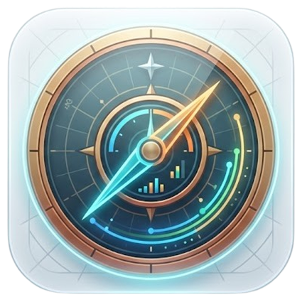

<p align="center"><a href="docs/README.zh-CN.md"><strong>简体中文 (Chinese documentation)</strong></a></p>

<p align="center">
  
</p>

<h1 align="center">Astrolabe Panel</h1>

<p align="center">
  A modular <strong>NAS homepage</strong>, <strong>homelab dashboard</strong>, <strong>start page</strong>, and <strong>monitoring canvas</strong>—lay it out like a slide deck.</p>

<p align="center">
  Widget-first · WYSIWYG · Drag-and-drop · Snap grid · Host / Docker / Netdata metrics
</p>

<p align="center">
  <a href="https://github.com/ThingOfNull/astrolabe_panel/actions/workflows/ci.yml"></a>
  <a href="https://github.com/ThingOfNull/astrolabe_panel/releases"></a>
  <a href="https://github.com/ThingOfNull/astrolabe_panel/stargazers"></a>
</p>

<p align="center">
  
</p>

<p align="center"><sub><strong>Dashboard</strong> — canvas homepage</sub></p>

<p align="center">
  
</p>

<p align="center"><sub><strong>Settings</strong> — configure widgets and board preferences</sub></p>

Astrolabe Panel is a **highly customizable**, lightweight homepage and board: drag widgets on a snap-to-grid canvas, keep probes next to bookmarks, and pull metrics from the **host**, **Docker**, or **Netdata REST**—navigation and everyday monitoring in one simple surface.

## How is Astrolabe Panel different from other home panels?

Traditional start pages are great for static links, but homelab users still jump between bookmarks, status pages, and metric UIs—and many **home panel** layouts are fixed templates when what we want is true WYSIWYG. Astrolabe turns your front page into an **editable, data-driven canvas**: live updates; bookmark tiles with optional probes; charts and gauges beside links. Tweaking layout should feel like adjusting a dashboard—not like writing code in config files.

The project stays **light on delivery**: the UI ships inside **one `astrolabe` binary** for NAS or small VMs—tune colors, icons, and wallpaper without maintaining a separate design stack just to reskin.

## Core Features

- **Composable layout:** WYSIWYG, drag-and-drop, and snap-to-grid alignment—less fiddling with raw coordinates.
- **Lightweight runtime:** `make build` yields a **single file**; idle memory is typically on the **~30 MB** range (widgets and scrape interval affect this).
- **Deep customization:** Dark / light themes and CSS variables; Iconify icons; optional wallpaper and glass-style chrome.
- **Live metrics:** Host (CPU, memory, load, disk, network), **Docker**, **Netdata**; line/bar charts, gauges, status grids, and more.
- **Beyond bookmarks:** Global quick search (**Ctrl+K**), clock, weather (**API limitation: mainland China only for now**), text blocks, dividers; bookmark widgets with probes.
- **Portable config:** Export/import boards, data sources, and widgets.

## 🌟 Feature Overview

### 🧩 Dashboard canvas

> **Arrange widgets like slides—see the board as your users will.**

- ✨ **Grid snap:** Predictable positioning without micromanaging coordinates.
- 🔄 **Live sync:** Push updates over WebSocket so edits and metric refreshes stay in step.
- 📦 **Imports:** Bring layouts and widgets back from JSON snapshots.

### 📊 Metrics & data sources

> **Hook host, containers, or Netdata into the same canvas.**

- 🖥️ **Host & Docker adapters** deliver core signals without spinning up extra services.
- 📈 **Netdata REST:** plug into an existing Netdata instance for rich metrics on the canvas.

### 🎨 Look & feel

> **Theme and visuals in one place—no parallel design toolchain.**

- 🌙 **Colors:** tweak colors for chrome and elements throughout the UI.
- 🖼️ **Wallpaper & icons:** upload your own backgrounds and icons, or use Iconify.

## Quick start

### Docker

```bash
docker compose up -d --build
# Open http://localhost:8080
```

Data is persisted in a compose-mounted volume, usually under `/data/.astrolabe_panel/` inside the container.

### Build from source

Requirements: **Go 1.25+**, **Node 22**, **pnpm 10+**, **GNU make**.

```bash
make build    # vite build + go build → ./astrolabe
./astrolabe   # listens on :8080 by default
```

### Split dev servers

```bash
make dev-back   # API + WebSocket on :8080
make dev-web    # Vite on :5173 (proxies WebSocket to backend)
```

## Configuration

Resolution order:

1. `--config /path/to/config.json`
2. Environment variable `ASTROLABE_CONFIG`
3. Default: `~/.astrolabe_panel/config.json` (Windows: `%USERPROFILE%\.astrolabe_panel\config.json`)

If the file is missing, defaults are written on first launch.

## Common commands

```bash
make test       # go test ./...
make lint       # go vet + frontend ESLint
make smoke      # WebSocket JSON-RPC smoke client
cd web && pnpm e2e   # Playwright (install browsers once)
```

## Tech stack

**Backend:** Go, Gin, GORM (SQLite), Docker client, gopsutil, slog.  
**Frontend:** Vue 3, TypeScript, Pinia, vue-i18n, ECharts, Tailwind CSS.

## 🙏 Acknowledgments

Astrolabe Panel stands on these open-source projects—thank you to their authors and maintainers:

- [Vue.js](https://github.com/vuejs/core) — Progressive JavaScript framework for the UI.
- [Vite](https://github.com/vitejs/vite) — Tooling and dev server for the frontend.
- [Gin](https://github.com/gin-gonic/gin) — HTTP web framework for Go.
- [GORM](https://github.com/go-gorm/gorm) — ORM for SQLite persistence.
- [ECharts](https://github.com/apache/echarts) — Charting for metric widgets.
- [Tailwind CSS](https://github.com/tailwindlabs/tailwindcss) — Utility-first styling.

## License

MIT
